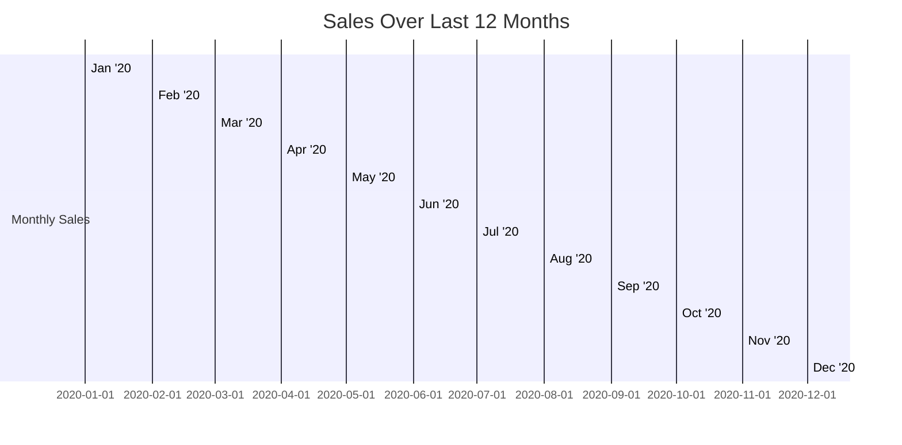

# Sales Performance: Last 12 Months
Visualizing our sales data from the past year.

- Sales have shown a significant increase toward the second half of the year, indicating a positive growth trend.
- November saw the highest sales, likely due to holiday shopping.
- There was a slight dip in sales during August, which could be attributed to seasonal variations.
- Overall, we've maintained a consistent sales performance throughout the year.

Note: The chart above represents a simplified model of our sales data. For a more detailed analysis, please refer to our comprehensive sales reports.